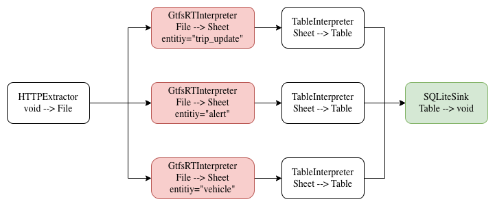
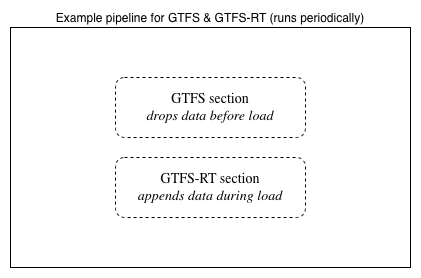

# RFC 0006: GTFS-RT Support

| | |
|---|---|
| Feature Tag | `gtfs-rt-support` | 
| Status | `DISCUSSION` | <!-- Possible values: DRAFT, DISCUSSION, ACCEPTED, REJECTED -->
| Responsible | `@schlingling` |
<!-- 
  Status Overview:
  - DRAFT: The RFC is not ready for a review and currently under change. Feel free to already ask for feedback on the structure and contents at this stage.
  - DISCUSSION: The RFC is open for discussion. Usually, we open a PR to trigger discussions.
  - ACCEPTED: The RFC was accepted. Create issues to prepare implementation of the RFC.
  - REJECTED: The RFC was rejected. If another revision emerges, switch to status DRAFT.
-->
Disclaimer: This RFC is part of my master-thesis "Archiving open transport data using the JValue tooling ecosystem" supervised by @rhazn.
## Summary
Introduces support for [GTFS-RT](https://developers.google.com/transit/gtfs-realtime) (realtime) endpoints and extends therefore functionality of [0002-mobility-extension](https://github.com/jvalue/jayvee/tree/main/rfc/0002-mobility-extension). With this RFC, Jayvee can then process pipelines, which are extracting static public transportation schedules and associated geographic information and on top  realtime updates about associated fleets like delays, cancellations, vehicle positions, etc.

## Motivation
When it comes to nearly realtime updates, Google introduced an additional specification GTFS-RT on top of GTFS. This specification provides real-time up-dates to transit schedules and locations. It allows developers to access real-time
information about the location and status of vehicles, as well as any disruptions
or delays in service. GTFS-RT data is typically provided in
shape of streaming data feeds that are updated in real-time as events occur.
This realtime-feed always needs its corresponding static feed, which defines the
schedule and dimensions like `agency.txt` or `routes.txt` around live updates. The realtime specification can be divided into three types
of additional information, which enriches the static GTFS-feed:
* Trip updates - cancellations, delays and changed routes
* Service alerts - unforeseen events with impact on the transportation net-
work
* Vehicle positions - realtime information on vehicles position in coordinates


## Explanation
In contrast to static GTFS, which only changes manually, when new schedules are
released, realtime feeds require a frequent update rate (in the range of seconds),
since live locations are played out. For this reason, it is specified that GTFS-RT is
streamed using the protocol buffer format, which corresponds to a very efficient
binary representation of the data. As a result, consuming
and processing a GTFS-RT-feed needs an additional encoding stage to convert
the messages to human readable plain text. The `gtfs-realtime.proto` textfile is used for parsing the protocol buffer into an JSON-like representation.

A simple GTFS-RT-Pipeline is shown in the picture below.
 

The red block types need to be created from scratch whereas the green block types are either already present or only require minor changes (this classification is also reflected in the following chapter titles).

Since realtime feeds require a frequent update rate, we enable a periodical load from GTFS **and** GTFS-RT data by following concept already discussed with @rhazn:

1. One pipeline containing both, GTFS and GTFS-RT sections.
2. Periodical execution of the pipeline.
3. An additional attribute for SQLite-sink indicates whether tables should be dropped before load starts. GTFS-tables are dropped every run, GTFS-RT-tables not, which leads to the dataset visualized above in the Output-SQLite-Database containing the static GTFS-information as well as  the incrementally growing RT-tables.

This concept results in following pipeline.



The thought on connecting them sequentially is, that once we want to logically validate the data model during load, we have the dependency to first load the static data and afterwards the realtime data because realtime depends on static. We just want to load realtime data to the sink, if the data is conform to the static data which was loaded in advance. Unfortunally state now we cannot model this sequential dependency in one pipeline(eg. by connecting the GTFS-sink with the GTFS-RT-Extractor) but to shed light on this the dependcy is already visualized in this figure..

## Block Types
### 1) GtfsRTInterpreter *(Requires implementation from scratch)*
Input: File, Output: Sheet

A GtfsRTInterpreter gets an entity ("vehicle", "trip_update" or "alert") to process from the incoming protobuf-file, decodes the protobuf-file and outputs the entity as a sheet. In a first step, just required columns (defined in `gtfs-realtime.proto`) are considered. As we dont have a dedicated mobility-extension folder in Jayvee this should be implemented in the std-extension (already discussed with @rhazn).
```
block MyGtfsRTInterpreter oftype GtfsRTInterpreter {
    entity: "vehiclePosition"; // TEXT: "vehiclePosition", "tripUpdate" or "alert"
}
```
### 2) SQLiteSink *(Requires minor change)*
The SQLite sink needs an additional attribute indicating whether table should be dropped before load starts. Since blocks currently just support one input, a boolean data type for dropping a table is enough.
```
block VehicleLoader oftype SQLiteLoader {
		file: "./gtfs.db";
    dropTable: false // BOOLEAN
}
```
## Drawbacks
The proposed concept is functional, but it could be more efficient if it would not involve dropping static data with each run. However, since addressing this issue would make the RFC more complex, we have decided to implement this optimization at a later stage, and focus on creating a first proof of concept for now.

## Alternatives
An alternative approach could involve using a generic block type called `JsonInterpreter` instead of the proposed `GtfsRTInterpreter`. This block type would parse incoming files into a new io-datatype called `JSON`. A downstream block type `JsonFlattener` would then flatten the `JSON`  into a tabular sheet representation (eg. by having a file map to some form of tree structure for JSON which maps to sheets). Since the flattening of generic JSON files into tabular representation is a fundamental topic for ETL systems, this approach should be discussed in a separate RFC as it falls outside the scope of the master thesis.
