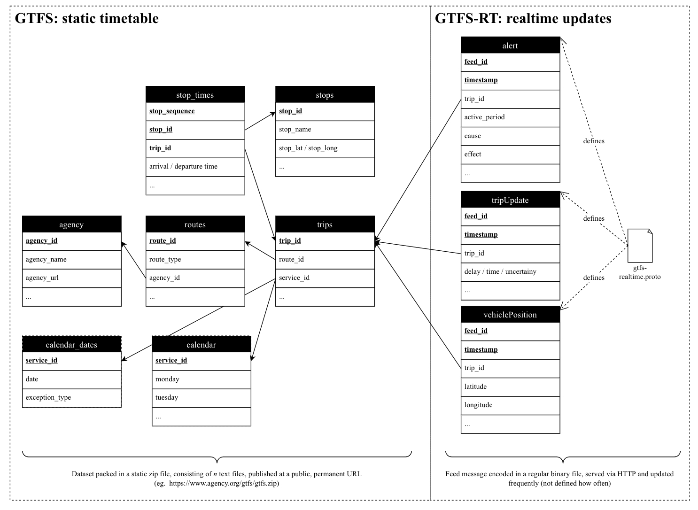

# RFC 0006: GTFS-RT Support

| | |
|---|---|
| Feature Tag | `gtfs-rt-support` | 
| Status | `DRAFT` | <!-- Possible values: DRAFT, DISCUSSION, ACCEPTED, REJECTED -->
| Responsible | `@schlingling` |
<!-- 
  Status Overview:
  - DRAFT: The RFC is not ready for a review and currently under change. Feel free to already ask for feedback on the structure and contents at this stage.
  - DISCUSSION: The RFC is open for discussion. Usually, we open a PR to trigger discussions.
  - ACCEPTED: The RFC was accepted. Create issues to prepare implementation of the RFC.
  - REJECTED: The RFC was rejected. If another revision emerges, switch to status DRAFT.
-->

## Summary
Introduces support for [GTFS-RT](https://developers.google.com/transit/gtfs-realtime) (realtime) endpoints and extends therefore functionality of [0002-mobility-extension](https://github.com/jvalue/jayvee/tree/main/rfc/0002-mobility-extension). With this RFC, Jayvee can then process pipelines, which are extracting static public transportation schedules and associated geographic information and on top  realtime updates about associated fleets like delays, cancellations, vehicle positions, etc.

## Motivation
When it comes to nearly realtime updates, Google introduced an additional specification GTFS-RT on top of GTFS. This specification provides real-time up-dates to transit schedules and locations. It allows developers to access real-time
information about the location and status of vehicles, as well as any disruptions
or delays in service. GTFS-RT data is typically provided in
shape of streaming data feeds that are updated in real-time as events occur.
This realtime-feed always needs its corresponding static feed, which defines the
schedule and dimensions like `agency.txt` or `routes.txt` around live updates. The realtime specification can be divided into three types
of additional information, which enriches the static GTFS-feed:
* Trip updates - cancellations, delays and changed routes
* Service alerts - unforeseen events with impact on the transportation net-
work
* Vehicle positions - realtime information on vehicles position in coordinates

## Explanation

<!-- 
  TODO: Explain the details of the RFC. 
  If the RFC contains more than a single cohesive aspect, structure this section accordingly.
  Make sure to provide realistic modelling examples on the example data set introduced above.
-->

## Drawbacks

<!-- TODO: (optional) Discuss the drawbacks of the proposed design. -->

## Alternatives

<!-- TODO: (optional) Point out alternatives to the design or parts of the design. -->

## Possible Future Changes/Enhancements

<!-- TODO: (optional) Point out what changes or enhancements you see in the future to the proposed concepts. -->
